# TRABALHO DE BACKEND
Este projeto consiste em uma **API RESTful** simplificada para o gerenciamento de alunos e professores, desenvolvida com o objetivo de aplicar conceitos fundamentais de desenvolvimento Java e arquitetura de software.

---
## 🛠️ Tecnologias Utilizadas

O projeto foi construído utilizando as seguintes ferramentas:

* **Linguagem:** Java 21
* **Framework:** Spring Boot
* **Banco de Dados:** PostgreSQL
* **Documentação/Testes:** Insomnia (Cliente HTTP)

---
## 🏗️ Arquitetura e Princípios REST

A API segue os princípios arquiteturais **REST**, garantindo uma comunicação padronizada e uma clara separação de responsabilidades.

### 📂 Divisão de Camadas (SoC)
O projeto está organizado para que cada parte do código tenha uma função específica:

| Camada | Responsabilidade                                                          |
| :--- |:--------------------------------------------------------------------------|
| **Controller** | Recebe as requisições (requests) e envia as respostas (responses) .       |
| **Service** | Regra de negócio                                                          |
| **Repository** | Responsável pela comunicação e persistência de dados no banco PostgreSQL. |
| **Model** | Define as entidades e a estrutura das tabelas do banco de dados.          |

### 🛰️ Comunicação
* **Formato:** As trocas de dados são realizadas inteiramente via **JSON**.
* **Verbos HTTP:** Uso semântico de `GET`, `POST`, `PUT` e `DELETE`.

---
## 💻 Detalhamento das Entidades

As entidades `Aluno` e `Professor` foram modeladas utilizando o **Lombok** para reduzir o código repetitivo (*boilerplate*) e o **JPA** para o mapeamento objeto-relacional.

### Anotações Principais:

* **Lombok:**
    * `@AllArgsConstructor`: Cria automaticamente o construtor com todos os campos.
    * `@NoArgsConstructor`: Cria o construtor vazio, exigido pelo Hibernate.
    * `@Data`: Gera automaticamente Getters, Setters, `toString`, `equals` e `hashCode`.

* **JPA/Hibernate:**
    * `@Entity`: Define que a classe é uma entidade gerenciada pelo JPA.
    * `@Table(name = "...")`: Mapeia a classe para uma tabela específica no banco de dados.
    * `@Id` & `@GeneratedValue`: Define a chave primária e a estratégia de autoincremento.

* **Dados das Tabelas:**
  * `@id`: Define que a variável a seguir é uma chave primária(id)
  * `@GEneratedValues(strategy = GenerationType.IDENTITY)`: Define que esse id vai ser autoincrementado automaticamente
  
* **Colunas**
  *  `Long id`: É a própria chave primária, explicada anteriormente
  *  `String nome`: Nome do Aluno ou Professor
  *  `String email`: Email para contato
  *  `String cpf`: O CPF do aluno ou professor
---
## 🚀 Endpoints da API (CRUD ALUNO)

Abaixo estão as rotas disponíveis para o recurso de Alunos (extensível para Professores):

| Método | Endpoint | Descrição | Status Sucesso |
| :--- | :--- | :--- | :--- |
| **POST** | `/Alunos` | Cria um novo registro no sistema. | `201 Created` |
| **GET** | `/Alunos` | Lista todos os registros cadastrados. | `200 OK` |
| **GET** | `/Alunos/{id}` | Busca um registro específico pelo ID. | `200 OK` |
| **PUT** | `/Alunos/{id}` | Atualiza os dados de um registro existente. | `204 No Content` |
| **DELETE** | `/Alunos/{id}` | Remove um registro permanentemente. | `204 No Content` |

## 🚀 Endpoints da API (CRUD PROFESSOR)

Abaixo estão as rotas disponíveis para o recurso de Alunos (extensível para Professores):

| Método | Endpoint       | Descrição | Status Sucesso |
| :--- |:---------------| :--- | :--- |
| **POST** | `/Professores` | Cria um novo registro no sistema. | `201 Created` |
| **GET** | `/Professores` | Lista todos os registros cadastrados. | `200 OK` |
| **GET** | `/Professores/{id}` | Busca um registro específico pelo ID. | `200 OK` |
| **PUT** | `/Professores/{id}` | Atualiza os dados de um registro existente. | `204 No Content` |
| **DELETE** | `/Professores/{id}` | Remove um registro permanentemente. | `204 No Content` |

---
## 🔍 Detalhamento Técnico das Implementações

### Injeção de Dependências
Utilizamos a anotação `@Autowired` para que o Spring injete a depedências de uma determinada classe sem que a divisão de trabalhos seja quebrada.

### Lógica do Service
#### Injeção de dependências `repository`, `@autowired (...)Repository`
    "(...)" é o nome da classe que estamos fazendo o service( no caso, ou aluno ou professor)

``` java
public void atualizar(...)PorId(Long id, Aluno (...)Editado) {
    (...)Editado.setId(id); // Garante que o ID da URL seja o mesmo do objeto
    (...)Repository.save((...)Editado); // O .save() faz update se o ID já existir
}

public void criar(...)((TIPO) (...)){
    (...)Repository.save((...));
}


public List<(TIPO)> listarTodos(...)(){
    return (...)Repository.findAll(); 
    // Retorna uma lista contendo todas as intâncias do tipo especificado
}
public Optional<(TIPO)> buscar(...)PorId(Long id){
    return (...)Repository.findById(id); 
    // Retorna a instância que possui o mesmo id digitado
}


public void deletar(...)PorId(Long id){
    (...)Repository.deleteById(id); 
    // Deleta a instância que possui id digitado
}
```

### Lógica do Repository
``` java
@Repository // Diz ao compilador que o código abaixo será do tipo repository

public interface (...)Repository extends JpaRepository<(TIPO), Long> {
} 

// Interface que extende as implementações de comunicação 
//com o banco do JpaRepository( Spring Data )
```


### Lógica do Controller
#### Injeção de dependências `Service`, `@autowired (...)Service`
### **Anotações:**

* **Anotações verbos HTTP:**
  * `@RestController`: Indica que o código abaixo é um controlador que segue a arquitetura REST.
  * `@RequestMapping("/(TIPO)")`: Mapeia o controlador pela URL.
  * `@PostMapping` : Recebe uma requisição do tipo **POST**
  * `@GetMapping` : Recebe uma requisição do tipo **GET**
  * `@DeleteMapping` : Recebe uma requisição do tipo **DELETE**
  * `@ResponseStatus` : Indica qual resposta HTTP deve ser entregue para essa requisição
    * `HttpStatus.OK`
    * `HttpStatus.CREATED`
    * `HttpStatus.NO_CONTENT`
  * `@RequestBody` : Indica que o tipo que será enviado no Body da resposta HTTP
  * `@PathVariable` : Extrai valores da URL como variáveis

``` java
    @PostMapping
    @ResponseStatus(HttpStatus.CREATED)
    public void criar(...)(@RequestBody (TIPO) (...))
    {
        (...)Service.criar(...)((...));
    }

  
    @GetMapping
    @ResponseStatus(HttpStatus.OK)
    public List<(TIPO)> listarTodos(...)()
    {
        return (...)Service.listarTodos(...)();
    }
    @GetMapping("/{id}")
    @ResponseStatus(HttpStatus.OK)
    public Optional<(TIPO)> buscar(...)PorId(@PathVariable Long id)
    {
        return (...)Service.buscar(...)PorId(id);
    }
    
    
    @DeleteMapping("/{id}")
    @ResponseStatus(HttpStatus.NO_CONTENT)
    public void deletar(...)PorId(@PathVariable Long id)
    {
        (...)Service.deletar(...)PorId(id);
    }


    @PutMapping("/{id}")
    @ResponseStatus(HttpStatus.NO_CONTENT)
    public void atualizar(...)PorId(@PathVariable Long id, @RequestBody (TIPO)(...)Editado)
    {
        (...)Service.atualizar(...)PorId(id, (...)Editado);
    }
```
---

### **Imagens do Insominia (Pasta 'imagens')**
### ALUNO

#### Criar
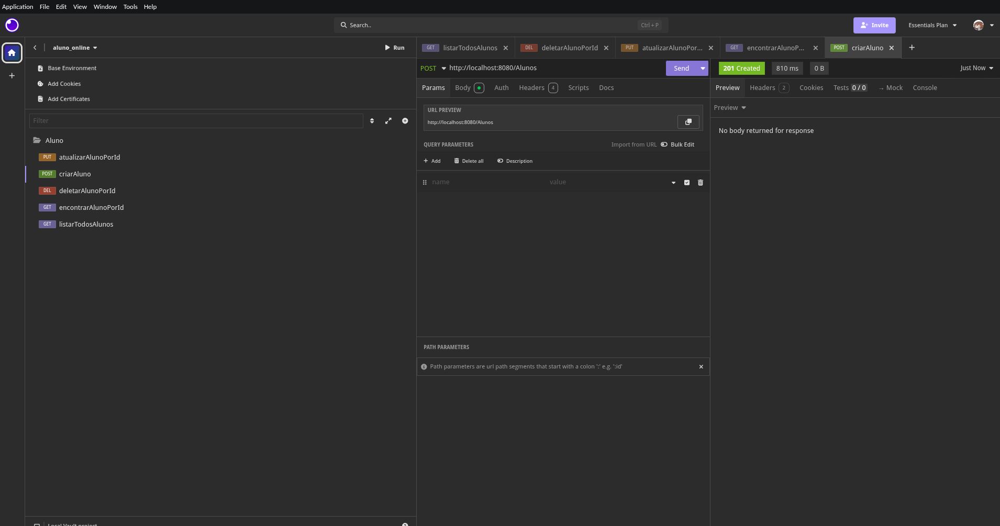
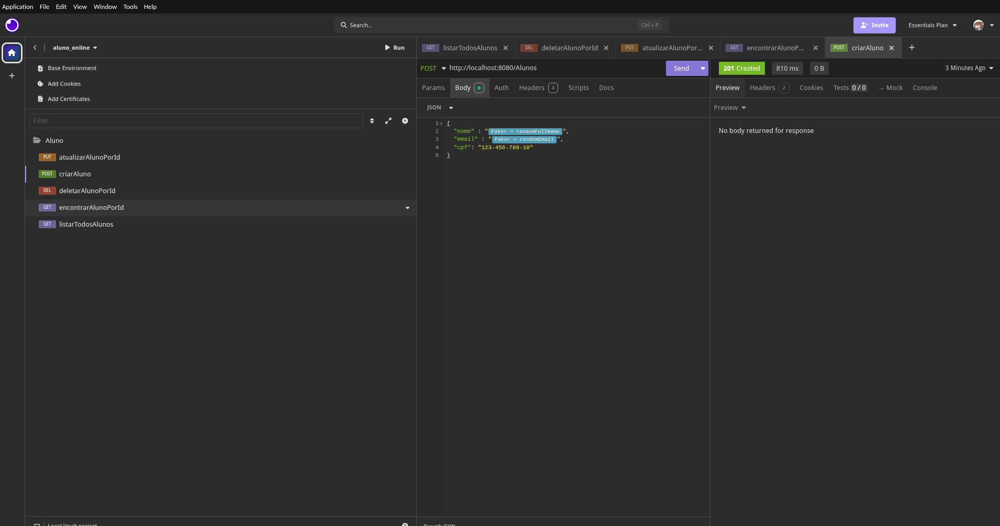

#### Encontrar
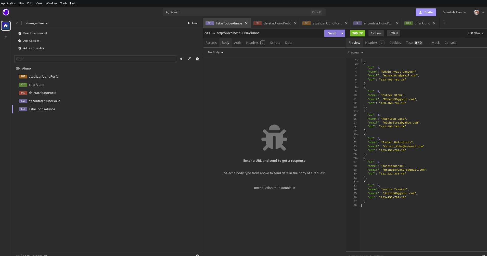
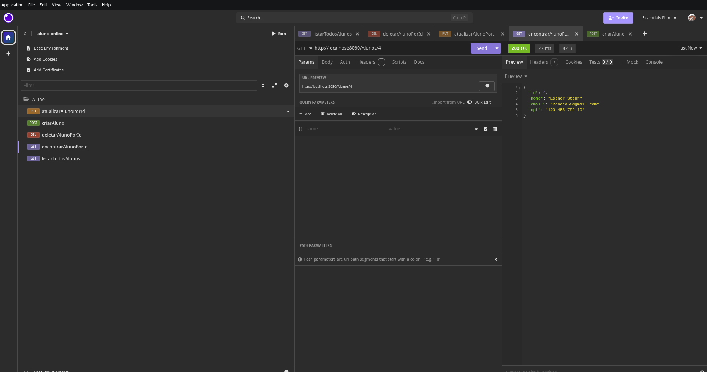

#### Atualizar
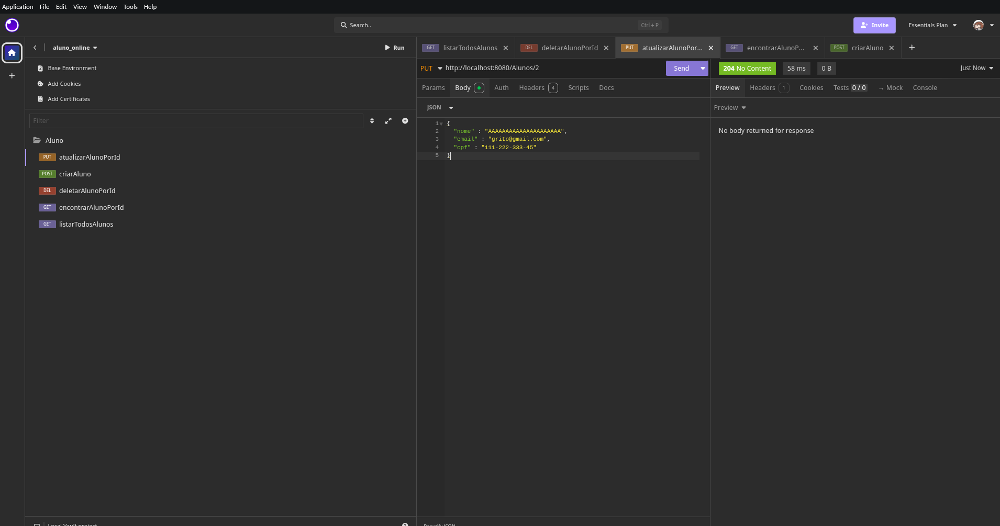

#### Deletar
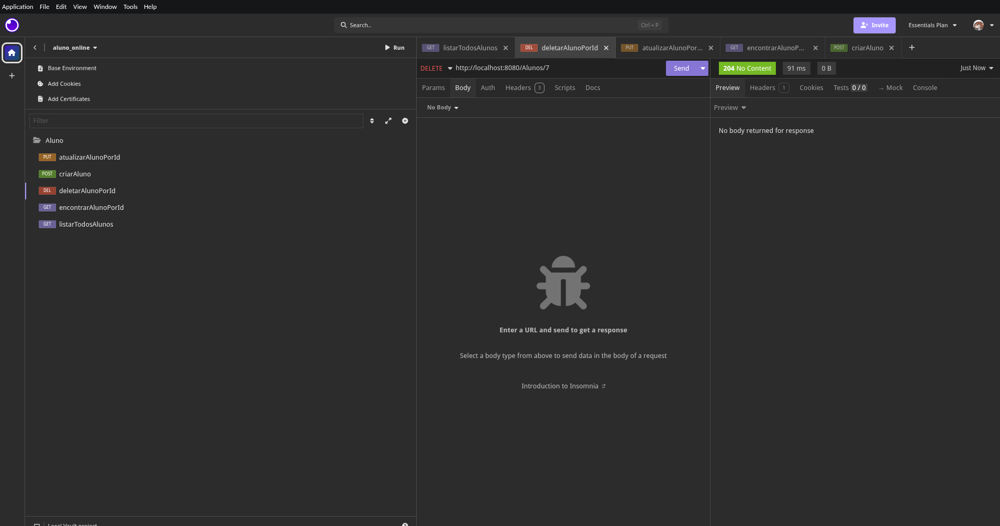
---

### Professor

#### Criar
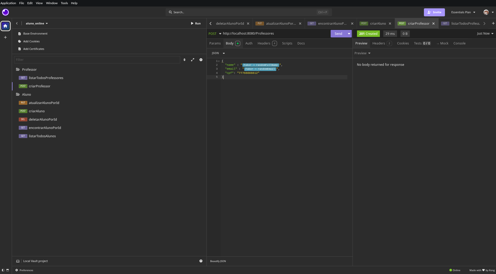

#### Encontrar
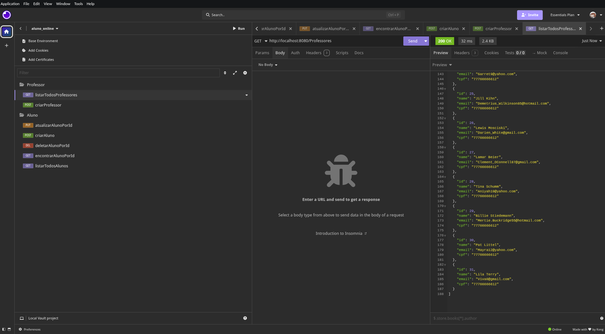
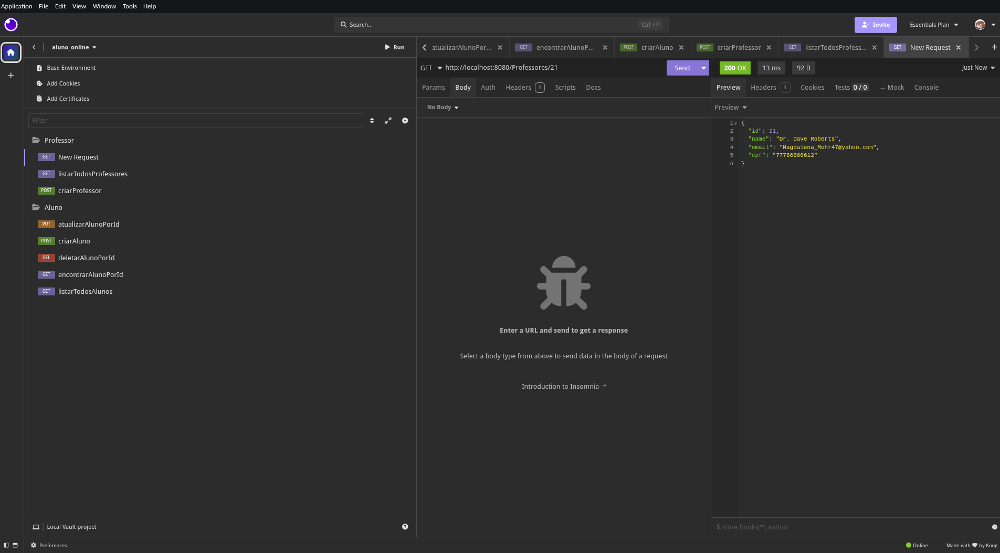

#### Atualizar


#### Deletar
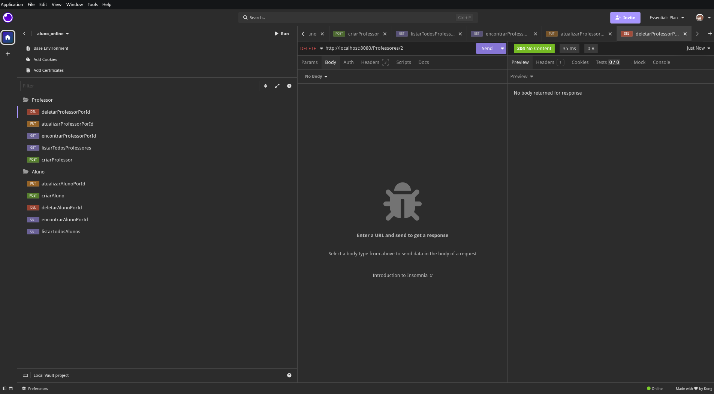
---

### **Imagens do DBEAVER**
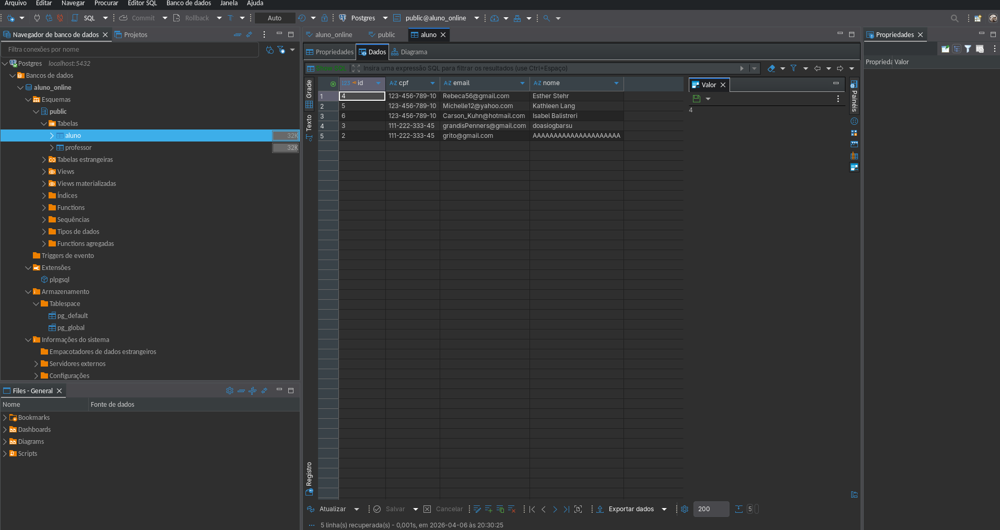
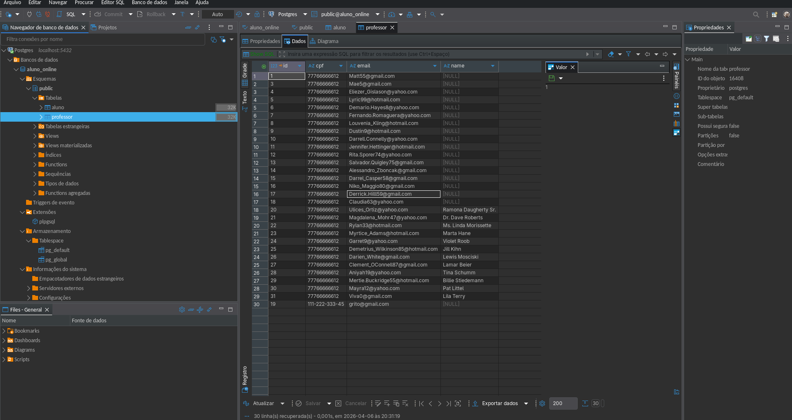